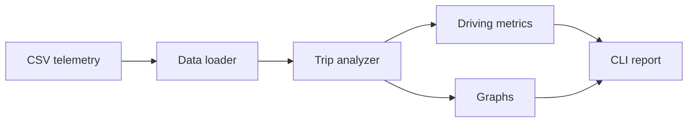

# DriveSense

DriveSense is a modular Python application for analyzing automotive telemetry
logs and turning raw vehicle signals into trip statistics, engineering plots,
and driving-behavior metrics.

> **Status:** MVP development in progress. The initial release uses CSV logs;
> the data-source boundary is designed for later OBD-II and CAN bus integration.

## Project goals

- Parse and validate vehicle telemetry from a CSV file.
- Calculate trip and engine summary statistics.
- Detect idling, aggressive acceleration, and hard-braking events.
- Generate clear plots for engine and vehicle signals.
- Produce an explainable driver score and trip classification.
- Support a future live ESP32/OBD-II data source without rewriting the analysis
  and visualization layers.

## Architecture



The CSV loader is the first implementation of a data source. A future serial
or CAN adapter can return the same normalized tabular schema to the rest of the
application.

## Telemetry schema

DriveSense stores telemetry in the metric units produced by standard OBD-II
PIDs. Display layers may convert these values to mph or degrees Fahrenheit.

| Column | Unit | Description |
| --- | --- | --- |
| `timestamp_s` | seconds | Elapsed trip time |
| `engine_rpm` | rpm | Engine rotational speed |
| `vehicle_speed_kph` | km/h | Vehicle road speed |
| `throttle_position_pct` | percent | Relative throttle position |
| `coolant_temperature_c` | degrees C | Engine coolant temperature |
| `intake_air_temperature_c` | degrees C | Intake-air temperature |
| `engine_load_pct` | percent | Calculated engine load |

The included sample is synthetic and reproducible. See
[`docs/sample_data.md`](docs/sample_data.md) for its scenarios and generation
method.

The CSV loader accepts additional signal columns for forward compatibility but
returns only the canonical schema above. It converts signals to numeric values,
sorts rows by timestamp, and rejects missing fields, duplicate timestamps,
non-finite values, and readings outside broad automotive sensor limits.

The trip analyzer converts normalized telemetry into a typed summary containing
trip duration; average, minimum, and maximum RPM; average and maximum speed;
average throttle position; average and peak coolant temperature; and average
intake-air temperature.

## Driving metrics

Rule-based event detection is intentionally explicit and configurable:

| Metric | Detection rule |
| --- | --- |
| Idle | Speed at or below 0.5 km/h and RPM from 600 through 900 |
| Aggressive acceleration | Throttle above 80% and RPM above 4,500 |
| Hard braking | Longitudinal acceleration at or below -3.0 m/s² |
| High coolant temperature | Coolant at or above 105 °C |

Contiguous flagged samples count as one event. The driver score starts at 100
and deducts 8 points per aggressive-acceleration event, 10 per hard-braking
event, 5 per high-coolant interval, and 2 per started 30 seconds of idle beyond
15% of the trip duration. Classification also considers severe-event count,
idle ratio, and average throttle so its labels remain explainable.

## Repository layout

```text
.
|-- main.py             # Command-line entry point
|-- data_loader.py      # CSV loading and schema validation
|-- analyzer.py         # Trip and engine summary statistics
|-- metrics.py          # Driving-event detection and scoring
|-- graphs.py           # Telemetry visualization
|-- scripts/            # Reproducible development utilities
|-- sample_data/        # Synthetic and real telemetry logs
|-- images/             # Generated plots and README screenshots
|-- docs/               # Design notes and project documentation
|-- requirements.txt    # Runtime dependencies
`-- README.md
```

## Planned MVP

The first release will provide:

- average and peak RPM, speed, coolant temperature, and intake temperature;
- total drive time and idle time;
- aggressive-acceleration and hard-braking event counts;
- an explainable 0-100 driving score;
- RPM, speed, throttle, coolant, and throttle-versus-RPM plots; and
- a command-line trip summary generated from a supplied CSV file.

## Quick start

The CLI will be enabled as the MVP modules are implemented.

```bash
python -m venv .venv
source .venv/bin/activate  # Windows: .venv\Scripts\activate
python -m pip install -r requirements.txt
python main.py sample_data/drive_log.csv
```

Validate the committed synthetic sample independently with:

```bash
python -m unittest discover
```

## Roadmap

1. Complete the CSV-based analysis MVP.
2. Add an interactive Streamlit or Plotly dashboard.
3. Stream live OBD-II data from an ESP32 over serial.
4. Capture and decode raw CAN frames.
5. Explore trip classification and fuel-economy models.

## License

License selection is pending before the first public release.
