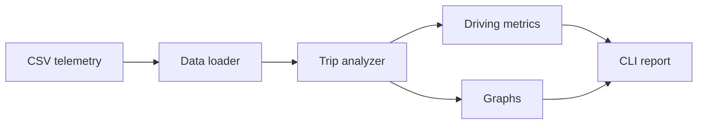
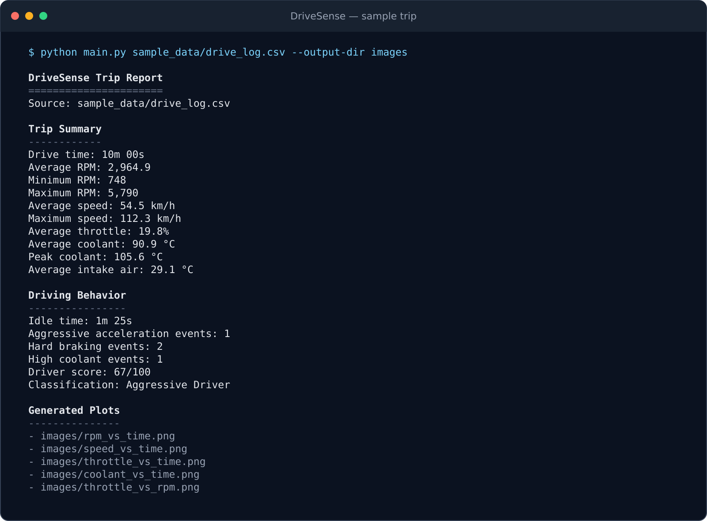

# DriveSense

[](https://github.com/dtelamar/friendly-goggles/actions/workflows/tests.yml)

DriveSense is a Python automotive telemetry analyzer that turns raw vehicle
logs into clear trip statistics, driving-behavior events, and engineering
plots. It works with signals such as engine RPM, vehicle speed, throttle
position, coolant temperature, intake-air temperature, and engine load.

The current version uses CSV data, so the full software pipeline can be tested
without connecting to a car. The project is structured so that a live ESP32,
OBD-II, or CAN bus source can be added later without rebuilding the analysis
side of the application.

> **Status:** The CSV-based command-line MVP is complete and tested.

## Why I built it

I wanted to build something that connects software engineering to my interest
in cars while showing more than one skill at a time. DriveSense gave me a way
to work with Python, data validation, modular design, automotive signals,
visualization, and testing in one project.

Starting with CSV logs was a practical engineering decision. It let me finish
and verify the software now instead of leaving the project as a half-built
hardware prototype. When I add live vehicle data later, the analysis, metrics,
and graphing modules can stay in place.

## What it does

- Loads and validates automotive telemetry from a CSV file
- Calculates trip, engine, and temperature statistics
- Detects idling, aggressive acceleration, hard braking, and high coolant
  temperature events
- Calculates an explainable driver score and classification
- Creates five plots that show how the vehicle behaved throughout the trip
- Prints a clean command-line trip report

## How it works



Each module has one clear job. `main.py` coordinates the workflow, while the
loader is the only part tied to the current input format. A future OBD-II or
CAN adapter only needs to return the same normalized columns for the rest of
DriveSense to keep working.

## Sample run

This report comes directly from running the bundled 10-minute drive through the
complete command-line workflow.



## Telemetry data

DriveSense uses metric units that line up with common OBD-II signals.

| Column | Unit | Description |
| --- | --- | --- |
| `timestamp_s` | seconds | Elapsed trip time |
| `engine_rpm` | rpm | Engine rotational speed |
| `vehicle_speed_kph` | km/h | Vehicle road speed |
| `throttle_position_pct` | percent | Relative throttle position |
| `coolant_temperature_c` | degrees C | Engine coolant temperature |
| `intake_air_temperature_c` | degrees C | Intake-air temperature |
| `engine_load_pct` | percent | Calculated engine load |

The loader does more than call `read_csv` and hope for the best. It checks for
required columns, converts each signal to a numeric type, sorts the data by
time, and rejects duplicate timestamps, missing values, infinite values, and
readings outside broad automotive sensor limits.

The included drive log is synthetic on purpose. It gives the project a
repeatable test drive with normal cruising, idling, aggressive acceleration,
hard braking, and a short high-temperature event. The generation method is
documented in [`docs/sample_data.md`](docs/sample_data.md).

## Driving behavior

The first version uses direct, configurable rules instead of hiding the logic
inside a black-box model:

| Metric | Detection rule |
| --- | --- |
| Idle | Speed at or below 0.5 km/h and RPM from 600 through 900 |
| Aggressive acceleration | Throttle above 80% and RPM above 4,500 |
| Hard braking | Longitudinal acceleration at or below -3.0 m/s² |
| High coolant temperature | Coolant at or above 105 °C |

Contiguous flagged samples count as one event instead of several separate
events. The driver score starts at 100 and applies documented penalties for
aggressive acceleration, hard braking, high coolant temperature, and excessive
idle time. That keeps the result easy to test and easy to explain: if the score
changes, there is a specific event behind it.

## Generated plots

Each run creates five headless PNG plots:

- RPM over time
- Vehicle speed over time
- Throttle position over time
- Coolant temperature over time, including the 105 °C threshold
- Throttle position versus RPM, colored by vehicle speed

The figures use deterministic filenames, so they can be regenerated from a new
trip without changing the rest of the workflow.

| Coolant temperature analysis | Throttle and engine-speed relationship |
| --- | --- |
| ![Coolant temperature][coolant-plot] | ![Throttle versus RPM][throttle-rpm-plot] |

## Try it

```bash
python -m venv .venv
source .venv/bin/activate  # Windows: .venv\Scripts\activate
python -m pip install -r requirements.txt
python main.py sample_data/drive_log.csv
```

The command prints the trip report in the terminal and writes the plots to
`output/`. A different destination can be supplied when needed:

```bash
python main.py sample_data/drive_log.csv --output-dir trip_report
```

The bundled sample produces the following key results:

| Result | Value |
| --- | --- |
| Drive time | 10 minutes |
| Idle time | 1 minute, 25 seconds |
| Aggressive acceleration events | 1 |
| Hard braking events | 2 |
| High coolant events | 1 |
| Driver score | 67/100 |
| Classification | Aggressive Driver |

## Testing

Run the complete test suite with:

```bash
python -m unittest discover
```

The tests cover CSV validation, summary calculations, event grouping, driver
scoring, plot generation, command-line output, and expected failure paths.

## Project structure

```text
.
|-- main.py             # Command-line workflow and report output
|-- data_loader.py      # CSV loading and schema validation
|-- analyzer.py         # Trip and engine summary statistics
|-- metrics.py          # Driving-event detection and scoring
|-- graphs.py           # Telemetry visualization
|-- tests/              # Unit and end-to-end workflow tests
|-- scripts/            # Reproducible development utilities
|-- sample_data/        # Synthetic telemetry log
|-- images/             # Generated plots and README screenshots
|-- docs/               # Design notes and project documentation
|-- requirements.txt    # Runtime dependencies
`-- README.md
```

## Next steps

1. Add an interactive Streamlit or Plotly dashboard.
2. Stream live OBD-II data from an ESP32 over serial.
3. Capture and decode raw CAN frames.
4. Explore trip classification and fuel-economy models.

## License

License selection is pending before the first public release.

[coolant-plot]: images/coolant_vs_time.svg
[throttle-rpm-plot]: images/throttle_vs_rpm.svg
